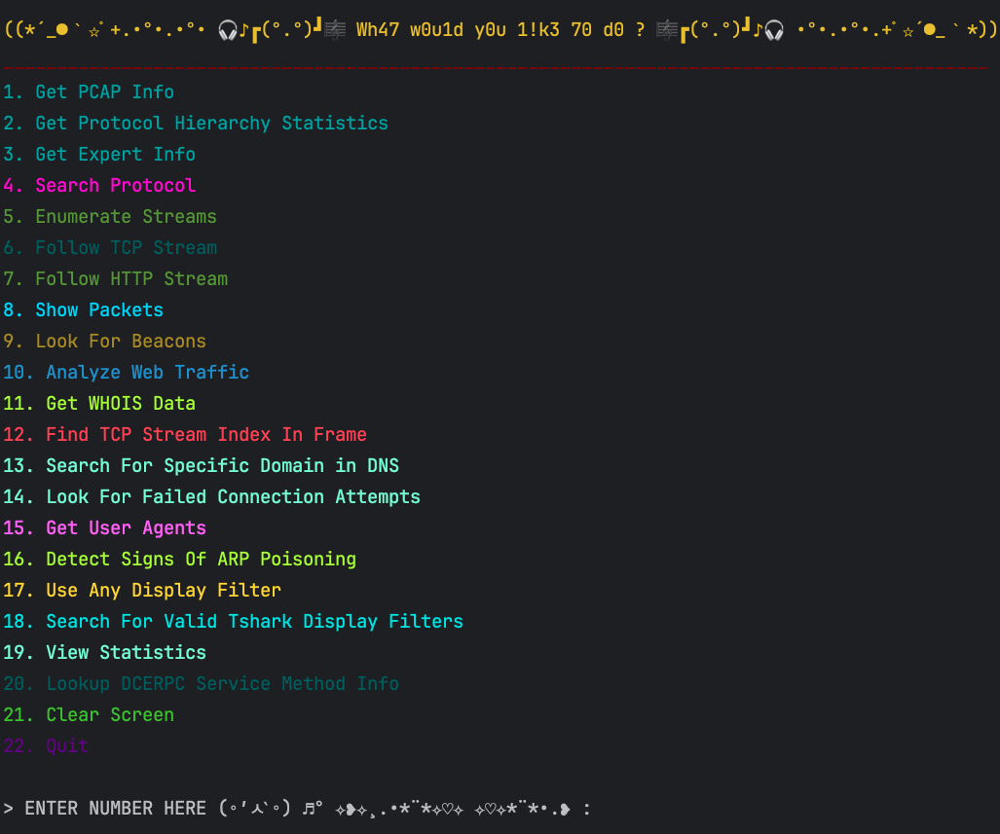
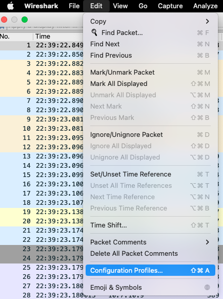
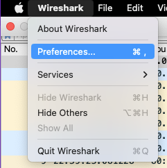
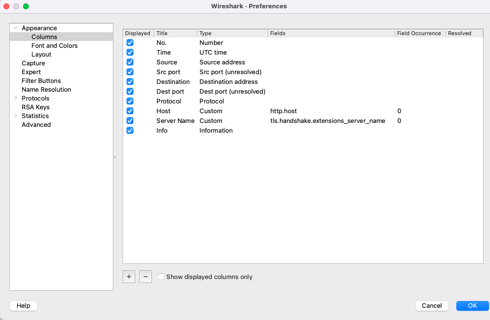

# TigerShark - A Python Wrapper for TShark
TigerShark is a Python script that provides a user-friendly interface for interacting with TShark, a network protocol analyzer. It allows you to perform various network analysis tasks, view statistics, and extract information from packet capture (PCAP) files. TigerShark simplifies the use of TShark's command-line capabilities and provides an easy-to-use menu-driven interface.

## Features
- View detailed PCAP file information.
- Analyze protocol hierarchy statistics.
- Retrieve expert information about packets.
- Search for specific protocols and display packet details.
- Enumerate streams and analyze individual packets.
- Follow TCP and HTTP streams.
- Display packet contents and hex dumps.
- Search for beacons.
- Analyze web traffic and extract HTTP data.
- Retrieve WHOIS information for IP addresses.
- Find TCP streams by frame index.
- Search for specific domain names in DNS traffic.
- Detect failed connection attempts.
- Extract user agent information.
- Detect signs of ARP poisoning.
- Apply custom display filters.
- List valid Tshark display filters.
- View various network statistics.
- Search for DCERPC abuse information.

## Usage
1. Run `TigerShark.py` and provide the path to a PCAP file when prompted.


2. Choose from a variety of options in the interactive menu to perform specific tasks or analyses on the PCAP file.




## Requirements
- Python 3.x
- Mac or Linux.  Support for Windows is coming soon.
- WireShark (installed to default location)
- Configuration profile named THunt (e.g., /Users/username/.config/wireshark/profiles/THunt)

  It doesn't matter how you have the columns arranged, just that
  you have a profile named THunt.  It's easy to setup:

  Launch WireShark.

  Go to: Edit -> Configuration Profiles

  

  Click the + to add a new profile

  

  Give it a name (THunt), select it, then click OK.

  See the name in the bottom-right?

  

  TigerShark will now see your new configuration profile.

  Click on WireShark -> Preferences -> Columns

  

  Feel free to arrange the columns how you want:

  

## Installation

1. Clone the TigerShark repository to your local machine:
   ```bash
   git clone https://github.com/RandomLegend3/TigerShark.git
   ```

2. Navigate to the TigerShark directory:
   ```bash
   cd TigerShark
   ```

3. Run the `TigerShark.py` script:
   ```bash
   python src/TigerShark.py
   ```
